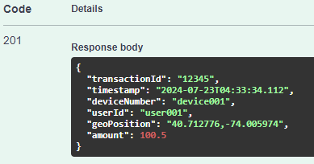

## Instrucciones de Ejecución

### Clonar el Repositorio

Clona el repositorio público desde GitHub.

`` git clone <https://github.com/UnoMaXs/transporte-api> ``

Ve al directorio del proyecto

`` cd backend-transporte-api ``

### Construir la Aplicación con Maven

Asegúrate de tener Maven instalado en tu sistema.

``mvn clean install``

### Configurar y Ejecutar los Contenedores Docker
Asegúrate de tener Docker y Docker Compose instalados en tu sistema. Navega al directorio donde se encuentra el archivo `docker-compose.yml`.

``docker-compose up --build``

### Verificar el Despliegue
* La aplicación Spring Boot se ejecutará en `http://localhost:8080`.
* la aplicación al tener swagger es posible de manipular en `http://localhost:8080/swagger-ui/index.html`.
* MongoDB estará accesible en `mongodb://localhost:27017`.
* Kafka estará accesible en `localhost:9092`.

## Enviar Solicitudes POST a la API

Puedes utilizar herramientas como curl, Postman o el ya incluido Swagger para enviar solicitudes POST a la API.

### Ejemplo con \`curl\`

curl -X POST http://localhost:8080/api/v1/transactions \
-H "Content-Type: application/json" \
-d '{
"transactionId": "12345",
"timestamp": "2024-07-22T10:00:00",
"deviceNumber": "device001",
"userId": "user001",
"geoPosition": "40.712776,-74.005974",
"amount": 100.50
}'
\`\`\`

### Ejemplo con Postman

1. Abre Postman.
2. Crea una nueva solicitud POST.
3. Establece la URL a http://localhost:8080/api/v1/transactions\.
4. Establece el tipo de contenido a \`application/json\`.
5. En el cuerpo de la solicitud, añade el siguiente JSON:

{ \
"transactionId": "12345", \
"timestamp": "2024-07-22T10:00:00", \
"deviceNumber": "device001", \
"userId": "user001", \
"geoPosition": "40.712776,-74.005974", \
"amount": 100.50 \
}

### Ejemplo con Swagger

## Documentación

### Consideraciones Asumidas

1. **Formato de Fechas**: Se asume que todas las fechas y horas estarán en formato ISO 8601.
2. **Alcance del Rendimiento**: Se asume que las pruebas de rendimiento se realizarán en un entorno local utilizando Docker.
3. **Configuración de Kafka y MongoDB**: Se asume que tanto Kafka como MongoDB se ejecutarán en contenedores Docker y estarán accesibles en \`localhost\`.

### Estrategias Utilizadas

1. **Spring Boot**: Se utiliza Spring Boot para crear una aplicación RESTful que maneja las transacciones y resúmenes diarios.
2. **MongoDB para Almacenamiento**: Se utiliza MongoDB como base de datos NoSQL para almacenar las transacciones y los resúmenes diarios.
3. **Kafka para Mensajería**: Se utiliza Kafka como broker de mensajería para registrar las transacciones.
4. **Docker para Contenedores**: Se utiliza Docker para contenerizar la aplicación y sus dependencias, incluyendo MongoDB y Kafka.
5. **Tareas Programadas**: Se utiliza el planificador de tareas de Spring para generar resúmenes diarios automáticamente.

### Guía de Uso

1. **Iniciar la Aplicación**
   - Sigue las instrucciones de la guía de ejecución para clonar el repositorio, construir la aplicación y ejecutar los contenedores Docker.

2. **Enviar Transacciones**
   - Utiliza curl, Postman o Swagger para enviar solicitudes POST a la API de transacciones.
   - Asegúrate de que el formato del JSON es correcto y que los campos obligatorios están presentes.

3. **Verificar el Almacenamiento**
   - Verifica que las transacciones se están almacenando en MongoDB. Puedes usar una herramienta como MongoDB Compass para conectarte a MongoDB y revisar la colección \`transactions\`.

4. **Verificar el Registro en Kafka**
   - Asegúrate de que las transacciones se están registrando en Kafka. Puedes usar una herramienta como \`kafka-console-consumer\` para verificar los mensajes en el tópico \`transactionTopic\`.

5. **Verificar los Resúmenes Diarios**
   - Asegúrate de que los resúmenes diarios se están generando y almacenando en MongoDB. Revisa la colección \`dailySummaries\` en MongoDB.

6. **Probar el Sistema**
   - Realiza pruebas de rendimiento para asegurar que el sistema puede manejar 10,000 transacciones por minuto y que cada transacción se procesa en menos de 100 ms.

